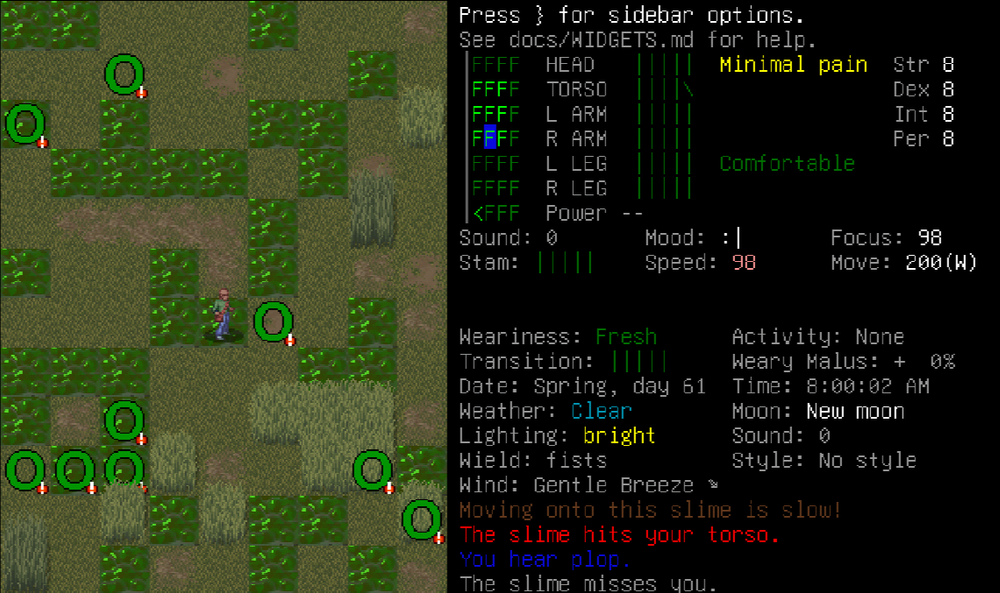

# Slime-a-clysm

A mod of Cataclysm: Dark Days Ahead, where instead of zombies, the dominant enemy is slime monsters - survive in a world full of various types of slime monsters.

I also created my own various types of slime monsters and a slime forest that may appear in-game as well

If you discover a bug or have a feature request, feel free to [open an issue](https://github.com/fungamer2-2/CDDA-Slime-a-clysm/issues/new).

## How to use this mod
- Have Cataclysm: DDA, 0.G stable installed 
- Download and place the "SlimeClysm" folder inside "data/mods" 

## Current slime monster variants in this mod
- Slime - a regular green slime, has no special abilities
- Red slime - regenerates its health over time
- Orange slime - faster than the green slime
- Yellow slime - has electric attacks
- Cyan slime - deals additional cold damage and emits cold air
- Blue slime - emits a blue cloud of gas that causes a disorientation effect
- Purple slime - Randomly teleports short distances every so often
- Pink slime - regenerates its own health, heals nearby allies
- Dasher slime - Occasionally dashes forward quickly towards a target
- Transparent slime - It's so transparent that it's hard to see from a distance (becomes invisible beyond a certain distance depending on Perception)
- Black slime - It absorbs light, making it almost invisible in the dark unless adjacent
- Dissolver slime - Attempts to wrap around its target, then secrete a highly acidic chemical
- Speedy slime - It is very fast and has a higher dodge
- Booster slime - can speed up itself and its allies
- Amoeba slime - spawns in large groups, sticks together, they may spawn more amoeba slimes (only when close to target to prevent exponential growth), defeating one of them deals some damage to surrounding amoeba slimes
- Slime biter - small, very fast and aggressive red slimes, will attempt to bite the target
- Slime hopper - hops around, towards you if far away, randomly if close, very evasive
- Slime drainer - attempts to latch onto its target to drain the target's energy so it can regenerate itself
- Aqua slime - has the ability to swim, camouflaged in water
- Intelligent slime - more intelligent in movement and behavior
- Glowing slime - emits some light and glows in the dark
- Lava slime - emits hot air and smoke, deals heat damage, occasionally releases chunks of hot molten rock which deals heat damage to those nearby (may cause fire on nearby tiles)
- Rubber slime - very durable, highly resistant to bashing and bullet damage, practically immune to electric damage
- Polymer slime - moderate amount of durability, has a slight self-healing property (regenerates 2 HP/turn)
- Diamond slime - resistant to certain damage types, has a special attack that releases diamond shards from itself, dealing cut damage to nearby targets
- Stone slime - more durable and deals more damage, has the "slam" attack
- Non-newtonian slime - made of a substance that acts like a liquid in most cases, but acts like a solid when subject to force
- Tough slime - higher damage resistance than a normal slime
- Toxic slime - attacks may poison target, releases toxic clouds
- Slime constrictor - attempts to wrap around the target so it can attempt to squeeze them 
- Giant slime leaper - leaps towards its target, which if it lands on them, can deal a lot of damage and knock them down
- Queen slime - A gigantic slime that can spawn new slimes, and may try to engulf its target in slime as well.

In addition, most types have a large variant. The large variants are larger and tougher, and they split into two of the normal-sized variants on death.
